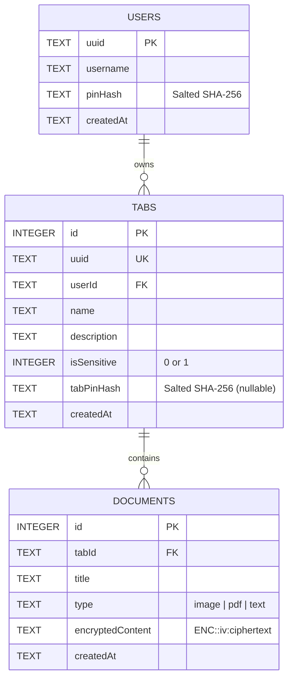
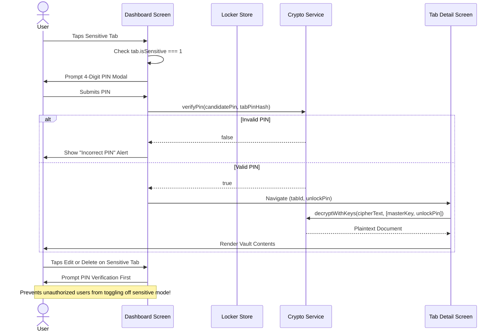

# OfflineLocker — Technical Architecture & Security Specification

## 1. Executive Summary
**OfflineLocker** is an air-gapped, privacy-first personal vault mobile application designed for zero-trust offline storage of sensitive documents, photos, identification cards, credentials, and notes. The application enforces a **Zero-Cloud, Zero-Telemetry, Client-Side Only** architecture: data never leaves the physical device without explicit, user-initiated encrypted export.

---

## 2. Technology Stack Overview

| Layer | Technology | Version | Purpose |
| :--- | :--- | :--- | :--- |
| **Core Framework** | React Native | 0.86.3 | Cross-platform mobile runtime (iOS & Android) |
| **App Platform / SDK** | Expo SDK | 57.0.0 | Native build tooling, runtime bridges, and hardware APIs |
| **Language** | TypeScript | 6.0.3 | Strict static typing, type safety, and compile-time contract enforcement |
| **State Management** | Zustand | 5.0.14 | Lightweight, unopinionated atomic global store |
| **Navigation** | React Navigation (Native Stack) | 7.x | High-performance hardware-accelerated 60fps native transitions |
| **Cryptographic Engine** | CryptoJS / Expo Crypto | 4.2.0 | AES-256 cipher operations, SHA-256 key derivation, PBKDF2/salting |
| **Local Database** | Expo SQLite (`expo-sqlite`) | 57.0.2 | Embedded ACID-compliant relational SQL engine |
| **File & Cache System** | Expo FileSystem (`expo-file-system`) | 57.0.6 | Sandboxed app storage and ephemeral cache management |
| **Media & Imaging** | Expo Image Manipulator & Picker | 57.0.16 | Memory-safe downsampling, EXIF normalization, and local file ingestion |
| **Native Document Sharing**| Expo Sharing (`expo-sharing`) | 57.0.18 | OS-level intent sharing (AirDrop, Files, Drive, Print) |
| **Sandboxed Document View**| React Native WebView | 13.16.1 | Isolated sandbox for multi-format local document rendering |
| **Web Target Fallback** | React Native Web + OPFS Worker | 0.21.2 | Origin Private File System browser execution for desktop preview |

---

## 3. Cryptography & Security Model

```mermaid
flowchart TD
    subgraph Master Key Derivation
        UP[User Master PIN] -->|SHA-256 + Salt| MK[pinHash / Master Vault Key]
    end

    subgraph Document Ingestion & Storage
        RAW[Raw Document / Notes / Base64] --> AES_ENC["AES-256-CBC Encryption<br/>(Key: pinHash, IV: 16-byte zero IV)"]
        AES_ENC --> CIPHER["Payload: ENC::iv:ciphertext"]
        CIPHER --> DB[(SQLite Local Database)]
    end

    subgraph Document Retrieval & Decryption
        DB --> READ[Read Ciphertext]
        READ --> CAND[Multi-Key Candidate Decryption]
        CAND --> TRY1["Attempt 1: pinHash (Master Key)"]
        CAND --> TRY2["Attempt 2: Tab unlockPin (Legacy Fallback)"]
        CAND --> TRY3["Attempt 3: default_fallback"]
        TRY1 -->|Valid UTF-8 / JSON / Base64| PLAIN[Plaintext In-Memory]
        TRY2 -->|Valid Payload| PLAIN
        PLAIN --> CACHE[Ephemeral Memory Cache<br/>(Ref-Only, Cleared on Tab Switch)]
    end
```

### 3.1 Encryption Algorithm
- **Cipher Standard**: Advanced Encryption Standard (AES) in **Cipher Block Chaining (CBC)** mode with a **256-bit key length**.
- **Padding**: PKCS#7 padding standard.
- **Wire Format**: Serialized with a versioned header to distinguish raw data from encrypted payloads:
  ```text
  ENC::<Base64-encoded IV>::<Base64-encoded Ciphertext>
  ```

### 3.2 Key Derivation Function (KDF) & PIN Hashing
- User master PINs and individual category PINs are never stored in plaintext on disk or in database records.
- Hashing uses a salted SHA-256 digest:
  $$\text{Hash} = \text{SHA256}(\text{PIN} \parallel \text{SALT})$$
- The 256-bit encryption key is generated via:
  $$\text{Key} = \text{SHA256}(\text{pinKey})$$
  This guarantees a uniform 32-byte cryptographic entropy for AES operations regardless of user PIN length.

### 3.3 Decryption Pipeline & Corruption Guard
- **Guarded Multi-Pass Decoding**:
  1. **Pass 1 (UTF-8)**: Decoded bytes are converted to UTF-8. If valid, strings (JSON objects, array manifests, base64 data URIs) return immediately.
  2. **Pass 2 (Latin-1 Fallback Guard)**: Hermes engine string allocations for large files can throw memory exceptions during URI decode. A Latin-1 fallback is used, **strictly guarded** with heuristic structure validation:
     $$\text{Latin-1 Accepted} \iff \text{prefix} \in \{\text{'data:'}, \text{'['}, \text{'\{'}\} \lor \text{printable ASCII Regex}$$
     This prevents incorrect decryption keys from producing pseudo-random binary character noise.
  3. **Candidate Key Strategy**: If a document was created under a previous schema or tab PIN, the decryption engine sequentially tests candidate keys (`[pinHash, tabPin, fallback]`) until clean plaintext is produced.

### 3.4 Brute-Force & Anti-Tamper Countermeasures
- **Exponential Lockout Engine (`LockoutService`)**:
  - Consecutive failed master login attempts trigger progressive hardware lockouts:
    - Attempt 1–3: Standard invalid PIN warning.
    - Attempt 4: 30-second system lock.
    - Attempt 5: 60-second system lock.
    - Attempt 6: **Automatic Emergency Data Wipe**.
- **Emergency Vault Purge**: If an attacker exceeds 6 attempts, all local SQLite tables (`users`, `tabs`, `documents`) are permanently dropped and deleted, destroying all encrypted data on device.

---

## 4. Local Data Storage & Persistence Engine

### 4.1 Relational Schema (`expo-sqlite`)
Data is stored locally in an embedded SQLite database inside the private OS application sandbox (`/data/user/0/...` on Android; `/var/mobile/Containers/Data/Application/...` on iOS).



### 4.2 Document Payload Format
Documents store heterogeneous content models inside their encrypted envelope:
- **Text Notes**: Encrypted plain UTF-8 string.
- **File Attachments Only**: Encrypted JSON array of RFC 2397 Data URIs (`["data:application/pdf;base64,..."]`).
- **Mixed Content (Files + Metadata)**: Encrypted JSON manifest:
  ```json
  {
    "notes": "User notes and description",
    "files": ["data:image/jpeg;base64,...", "data:application/pdf;base64,..."]
  }
  ```

### 4.3 Memory Management & Performance
- **In-Memory Decryption Cache**: Decrypted documents are cached in a React `useRef(Map<id, { plainText, array }>))` structure. This eliminates CPU-intensive AES recalculations during list rendering and scrolling. The cache is destroyed immediately upon tab switch or screen unmount.
- **Image Downsampling Pipeline**: Ingested high-resolution photos (often 12MB–48MB from modern smartphone cameras) are normalized using `expo-image-manipulator` to max 1600px width at 70% JPEG quality before encryption. This prevents out-of-memory crashes on the Hermes mobile JavaScript heap.

---

## 5. Security Gates & Access Control



---

## 6. Backup & Disaster Recovery Architecture

- **Format**: Self-contained, portable, encrypted JSON archive (`.json` format, specification `ewallet_v1`).
- **Encryption**: The entire backup manifest (users, categories, and all document records) is serialized and encrypted via AES-256 with a dedicated 4-digit Export PIN chosen at the time of backup:
  $$\text{Backup} = \text{AES-256}(\text{JSON(VaultData)}, \text{ExportPIN})$$
- **Portability**: Backups can be restored on any supported device (iOS, Android, or Web) by supplying the correct Export PIN.
- **Import Validation**: On restore, the app verifies JSON integrity, schema version, and tests cryptographic sanity before replacing local tables in an atomic SQLite transaction.

---

## 7. Cross-Platform Compatibility Specifications

| Platform Feature | Implementation Detail |
| :--- | :--- |
| **iOS Safe Areas & Notches** | `SafeAreaProvider` + `useSafeAreaInsets` dynamic padding (`Math.max(insets.top + 8, 16)`) protects against camera notch, Dynamic Island, and Home Indicator bar. |
| **Android Navigation** | Handled via React Navigation native stack header and dynamic flex layouts accommodating 3-button and gesture bars. |
| **Soft Keyboard Handling** | Platform-branching `KeyboardAvoidingView` (`behavior='padding'` on iOS, `behavior='height'` on Android). |
| **PDF Rendering** | Native `react-native-webview` sandbox for iOS/Android; local blob viewer for web. |
| **Air-Gapped Operation** | Zero outbound network requests; no tracking SDKs; no external CDN dependencies at runtime. |
